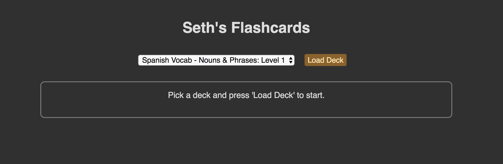
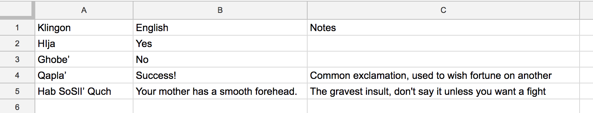
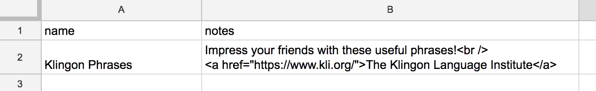

# Seth's Flashcards

My name is Seth and these are my flashcards. This application is designed to be simple to use, fast, and responsive to keyboard commands.

## Table of Contents
* **[Overview & Purpose](#overview--purpose)**
* **[User Guide](#user-guide)**
* **[Forking/Creating Your Own Flashcards](#forking--creating-your-own-flashcards)**
* **[Help](#help)**

## Overview & Purpose

When I started doing language study I couldn't find a flashcard application or website that worked quite the way I wanted. Here are some of the issues that I encountered with the available offerings:
* Inability to add or edit cards
* Distracting ads and other clutter
* Slow load times
* Minimal or no keyboard support

This application is an attempt to solve these problems with the following features:
* Decks and cards are managed via Google Spreadsheets. This makes it easy to add, remove, and edit cards en masse.
* No ads or other clutter. A minimal UI limits distraction and supports focused study.
* Once a deck is loaded there are no more calls to the server. Switching, hiding, revealing, and shuffling cards is all handled client side, meaning the application is quick and responsive.
* Once a deck is loaded all primary functionality is available via keyboard shortcuts (using one hand). After a small learning curve managing the flashcards via the keyboard is significantly faster than fiddling with a mouse.

## User Guide

When the app loads the first step is to select a deck from the dropdown list and click the `Load Deck` button. This will load all the cards in the deck. By default one column will be hidden and the other column will be visible.

There are several buttons available on the UI to interact with the deck:
* **Show 'left'**: Reveal all cards in the left column (and hide the right)
* **Show 'right'**: Reveal all cards in the right column (and hide the left)
* **Hide All**: Hide all cards
* **Show All**: Reveal all cards
* **Shuffle Cards**: Shuffle the deck (non-ignored cards only) and move the selection to the first card
* **Show Deck Notes**: Reveal any notes associated with the deck; this button is only visible if there are deck notes associated with the current deck

Individual cards can be managed via the mouse:
* Clicking a card will hide or reveal it
* Clicking the '**X**' button will remove the row from the deck and send it to the list of 'Ignored' cards (at the bottom of the deck)
* Clicking the '**^**' button for an ignored row will send it back into the deck

The fastest way to interact with the flashcards (once you get used to it) is via the keyboard shortcuts:
* **A**: Hide or reveal the left card in the selected row; same as clicking the card
* **S**: Hide or reveal the right card in the selected row; same as clicking the card
* **D**: Hide or reveal the notes card in the selected row; same as clicking the card
* **F**: Remove the selected row from the deck and send it to the list of 'Ignored' cards; same as clicking the '**X**' button
* **G**: Send the last 'Ignored' row back into the deck; this is useful as an 'undo' operation when cards are accidentally ignored
* **Q**: Shuffle the deck and move the selection to the first card; same as clicking the **Shuffle Cards** button
* **E**: Change the selection to the previous row
* **R**: Change the selection to the next row
* **Z**: Show 'left' column only; same as clicking the **Show 'left'** button
* **X**: Show 'right' column only; same as clicking the **Show 'right'** button
* **C**: Hide all cards; same as clicking the **Hide All** button
* **V**: Show all cards; same as clicking the **Show All** button

On the bottom-left of the screen is a **Switch Theme** button that allows you to switch between light and dark themes. This is purely cosmetic and has no effect on functionality.

The app technically works in mobile & other small browsers and responds to touch commands, but it is really intended for use with large screens and a keyboard.

## Forking/Creating Your Own Flashcards

Want to make your own flashcards or modify the app for your own use? Great!

### Running the application

Seth's Flashcards is designed to be simple, so there is no build step. Just open `index.html` in your favorite browser and you're ready to go.

### Configuring the application

There are a few configuration options available for Seth's Flashcards. These can be found in `js/config.js`. To make changes just update any of the available options and refresh the page. The most important option for creating your own set of flashcards is `TOPIC_SPREADSHEET_KEY`. More on that below.

* **TOPIC_SPREADSHEET_KEY**: The key for the public, published Google Spreadsheet containing flashcard values
* **DEFAULT_THEME**: Determines which theme should be loaded when the application starts, either `light` or `dark`
* **DEFAULT_VISIBLE_COLUMN**: Determines which column should be visible and which should be hidden when the application starts, either `left` or `right`

### Setting up the spreadsheet

Seth's Flashcards reads the card values from Google Spreadsheets using `Tabletop.js`. There is a little setup involved and the spreadsheets need to be formatted in a particular way for everything to work correctly. The steps below will help you get started.

1. Go to [Google Drive](https://drive.google.com) and create a new **Google Sheet**.
2. Add as many sheets as you want. Each individual sheet will correspond to a different deck of flashcards. The name of the sheet will be the name of the deck.
3. Each sheet needs 2 columns for values and optionally a third column for `Notes`. Values in the first row are used as headers and are not placed on cards. If you're adding a `Notes` column it **must** be the third column and have the heading `Notes`.
**Example**:

4. You also have the ability to add `Deck Notes` that will appear at the top of the page when a new deck is loaded. This can be useful for describing the content of decks and providing links to additional resources. To add deck notes add a new sheet to your Google Sheet with the specially reserved name `notes`. This sheet needs 2 columns with the headings `name` and `notes`. Values in the `name` column must match the name of a sheet **exactly**. Values in the note column support html, so feel free to add links, line breaks, bold text, etc.
**Example**:

5. Publish your spreadsheet and make it public. Check out the [Getting Started section of the Tabletop.js documentation](https://github.com/jsoma/tabletop#getting-started) for more detailed instructions on this part. The `tldr` steps are here:
  a. Publish your spreadsheet to the web.
  b. Share your spreadsheet with `anyone with the link`.
  c. Copy the url from the `link to share` (or just the key value from the link).
6. Within `js/config.js` set `TOPIC_SPREADSHEET_KEY` to the key or shareable link value copied from your Google Sheet.

And that's it! If everything is setup correctly when you load the page the dropdown menu should be populated with the names of the decks from your spreadsheet. Click `Load Deck` and you should be able to start interacting with your cards.

## Help

* Found a bug? Want a feature? Feel free to open an issue and/or create a PR. I want to keep this fast and simple, though, so nothing too fancy.
* Trying to make your own flashcards and something isn't working? Here are some tips:
  * Double check your spelling and your casing. If you're adding deck notes the sheet must be named `notes` and must have 2 columns with headings `name` and `notes`. The values in the `name` column must much the names of your other sheets **exactly**. Casing is important.
  * Did you publish your spreadsheet to the web **and** share it? You need to do both. Check the [Tabletop.js documentation](https://github.com/jsoma/tabletop#getting-started) if you're not sure.
  * Are there extra columns and/or blank rows in your spreadsheet? If so, get rid of them and try again.
* [Here](https://docs.google.com/spreadsheets/d/159Xdlkq_k9gr5kUt_ICNHOlVmqWXxTwxR3LBemNMKAU/edit?usp=sharing) is a link to the Google Sheet I use for Spanish/English flashcards. Feel free to use it as an example.